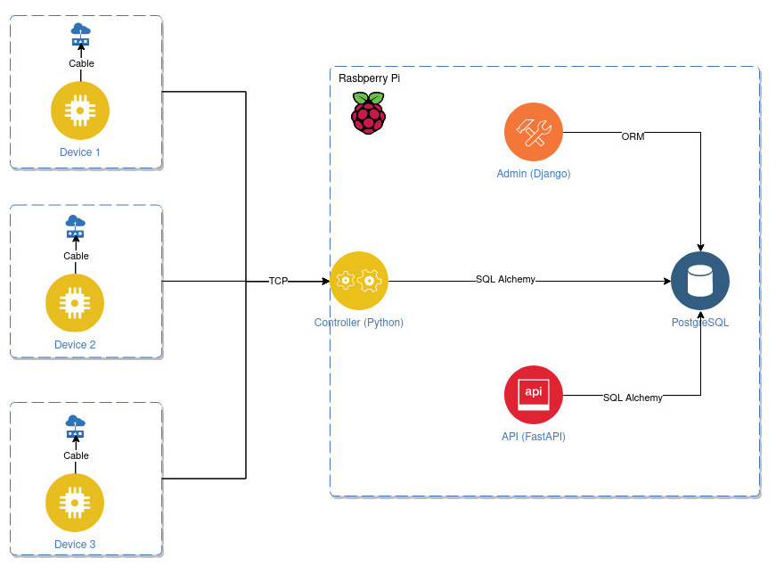

# rpi-home-automation

Home automation services packed into one repository meant to be ran on Raspberry PI.

## General architecture

Whole system consists of applications ran on Raspberry PI and other IoT devices. Each device has a set of sensors 
attached controlled by simple applications (WIP) which sends messages to the controller using a given protocol. 
The controller communicates with the database to determine what action should be executed. The action is a subprogram 
called by the main controller instance.

## Communication
Devices communicate with the controller through the TCP connection sending messages to a TCP server created by the 
controller. The message is in a given format, depending on a used protocol.

Right now the controller supports only a simple protocol called `Rpard`.

[Rpard reference](./controller/protocol.md)

